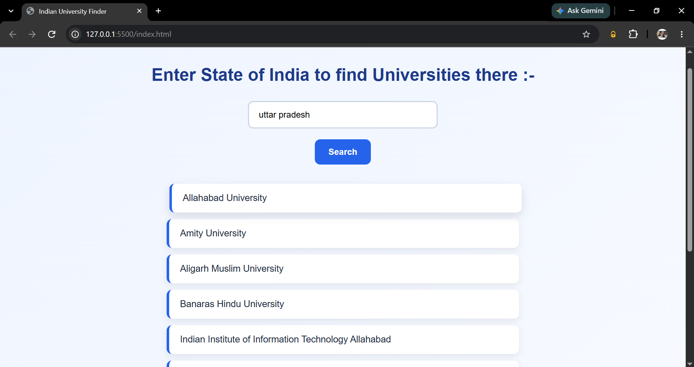

# Indian University Finder

Indian University Finder is a simple web project that allows users to search for universities in India by entering a state name.

This was my first project using an API, where I learned how to fetch and work with data from an external API using JavaScript and Axios.

## Preview



## Features

- Search universities by state
- Fetch university data from an external API
- Display matching universities dynamically
- Show a message when no university is found
- Simple and responsive user interface

## Technologies Used

- HTML
- CSS
- JavaScript
- Axios
- REST API

## API Used

Hipolabs Universities API

`http://universities.hipolabs.com/search?country=india`

## How It Works

1. Enter the name of an Indian state.
2. Click the Search button.
3. The application fetches university data from the API.
4. Universities belonging to the entered state are displayed on the page.

## What I Learned

- Basics of APIs
- Making API requests using Axios
- Using async/await
- Handling API responses
- Filtering data using JavaScript
- Dynamically creating HTML elements
- Working with external data in a web application

## Project Structure

Indian-University-Finder/
├── index.html
├── style.css
├── app.js
├── preview.png
└── README.md

## Future Improvements

- Add a state dropdown
- Display university websites
- Add university locations
- Add better error handling
- Add loading indicators

## Clone the Repository

```bash
git clone https://github.com/stutigupta1503/university-finder.git
```
## Author

Stuti Gupta

- GitHub: [@stutigupta1503](https://github.com/stutigupta1503)
- LinkedIn: [Stuti Gupta](https://www.linkedin.com/in/stuti-gupta1503/)
